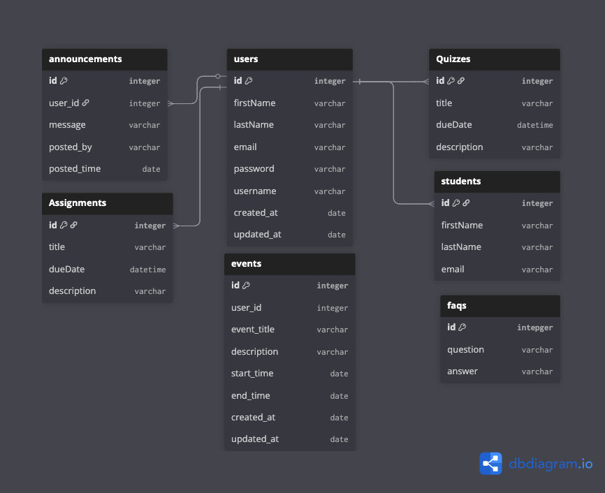

# ClassAssistant

## DB Schema

<!--  -->

## API Documentation


## Team Members
- Yitian
- Shir
- Henry
- Hemanth


Class Assistant is an application designed to help students stay organized and never miss important deadlines or class sessions. It provides timely reminders for upcoming classes, assignment due dates, quizzes, and campus events. Professors can also use the platform to send general announcements to the class. In addition, the application serves as a centralized hub for frequently asked questions (FAQs) and other essential course resources.

### a short note:
```
npx sequelize model:generate --name User --attributes first_name:string,last_name:string

npx dotenv sequelize db:migrate

npx sequelize seed:generate --name <name of seed>
npx dotenv sequelize db:seed:all
```
## Dependencies

`cd` into the `backend` folder and initialize the server's `package.json` by
running `npm init -y`.

`npm install` the following packages as dependencies:

- `cookie-parser` - parsing cookies from requests
- `cors` - CORS
- `csurf` - CSRF protection
- `dotenv` - load environment variables into Node.js from a `.env` file
- `express` - Express
- `express-async-errors` - handling `async` route handlers
- `helmet` - security middleware
- `jsonwebtoken` - JWT
- `morgan` - logging information about server requests/responses
- `per-env` - use environment variables for starting app differently
- `sequelize@6` - Sequelize
- `sequelize-cli@6` - use `sequelize` in the command line
- `pg` - use Postgres as the production environment database

`npm install -D` the following packages as dev-dependencies:

- `sqlite3` - SQLite3
- `dotenv-cli` - use `dotenv` in the command line
- `nodemon` - hot reload server `backend` files

In the __frontend__ folder, `npm install` the following packages as
dependencies:
- `npm i react` - Reactjs
- `js-cookie` - extracts cookies
- `react-redux` - React components and hooks for Redux
- `react-router-dom` - routing for React
- `redux` - Redux
- `redux-thunk` - Redux thunk

`npm install -D` the following packages as dev-dependencies:

- `redux-logger` - log Redux actions in the browser's DevTools console

### More tools
- `Nodemailer` to send email
- `multer` - to handle uploads